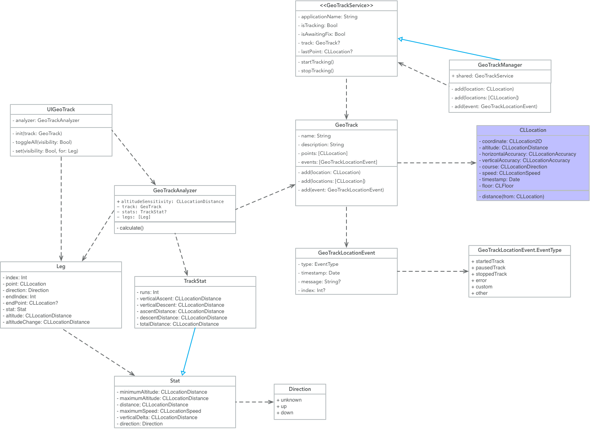

# GeoTrackKit
### An iOS Library for Geo Tracking

## Features
- Handles user authorization
- Handles track creation
- Handles track analyzing (for ascents, descents and other stats)
- Custom MKMapKit control for plotting your tracks on a map
- Example App to demonstrate capabilities

## Project Status
This project is currently a work in progress.

[](https://dashboard.buddybuild.com/apps/58a5d9cf4d78ba0100bda868/build/latest?branch=feature/BuildingBlocks)
[](https://intere.github.io/GeoTrackKit/docs/index.html)
[](http://cocoadocs.org/docsets/GeoTrackKit)
[](https://cocoapods.org/pods/GeoTrackKit)  
 [](https://cocoapods.org/pods/GeoTrackKit) [](https://cocoapods.org/pods/GeoTrackKit)

### Initial Roadmap
- [ ] Carthage Support
- [x] CocoaPods Support
- [x] Continuous Integration (Buddy Build)
- [x] Function Documentation
- [x] Jazzy Docs
- [ ] Performance Tests
- [x] SwiftLint Integration
- [ ] 90% Code Coverage

### Installation

## Installation Instructions

### CocoaPods
```ruby
pod 'GeoTrackKit', :git => 'git@github.com:intere/GeoTrackKit.git', :branch => 'master'
```

## Example Usage

```
// This will either start tracking, or prompt the user for access to track their location
GeoTrackManager.shared.startTracking()
```


This library also includes a map control that will map the GeoTrack:


## Inspiration
I've built a couple of variations of Geo Tracking applications, but I wanted to build a library for the community that I can share and get feedback and build a better product.

## Created and maintained by
[Eric Internicola](http://intere.github.io)


## Key Classes


## Documentation
See the generated documentation in the `docs` folder
